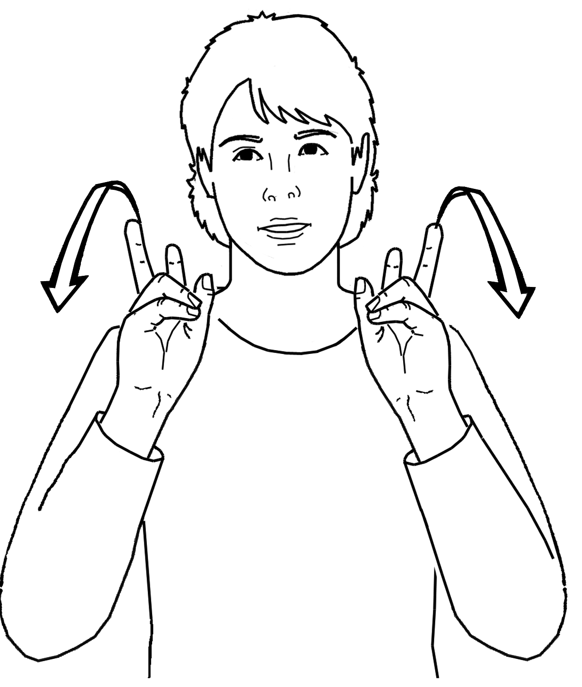
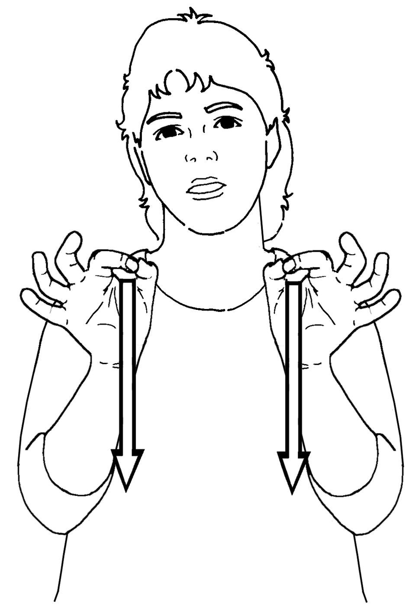
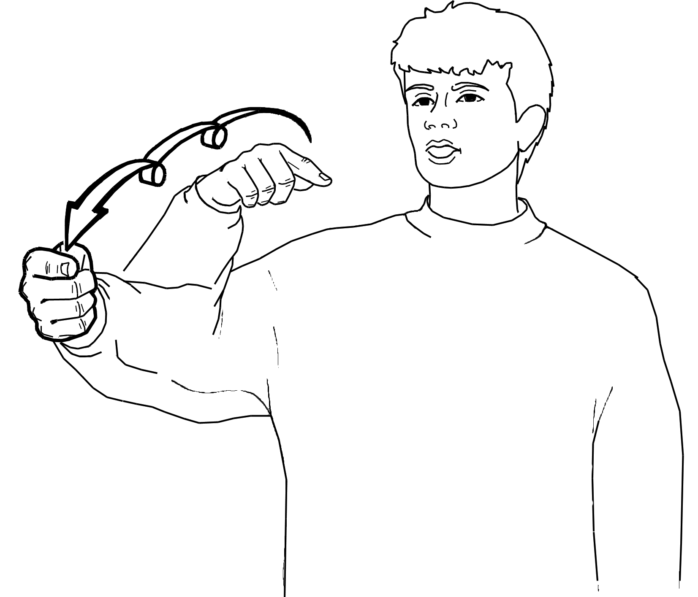

# SignWriting Illustration

Based on [sign/translate#114](https://github.com/sign/translate/issues/114).

People without previous SignWriting experience have a hard time understanding SignWriting notation.

This project aims to provide an alternative view to SignWriting, using computer generated illustrations of the signs.

## Data

We use multiple data sources with SignWriting and illustrations:

1. [Vokabeltrainer](datasets/Vokabeltrainer/README.md) - Swiss-German lexicon
2. [SignPuddle LSF-CH](datasets/SignPuddle/README.md) - Swiss-French lexicon
2. [SignSuisse](datasets/SignSuisse/README.md) - Swiss-French lexicon (images and illustrations)

The illustrations are of different people, usually in grayscale.
We use ChatGPT to generate the prompt to describe every illustration.

### Examples

|              |                                   00004                                    |                                   00007                                    |                                   00015                                    |
|:------------:|:--------------------------------------------------------------------------:|:--------------------------------------------------------------------------:|:--------------------------------------------------------------------------:|
|    Video     |   |   |   |
| SignWriting  |      |      |      |
| Illustration |  |  |  | 
|    Prompt    |                                    TODO                                    |                                    TODO                                    |                                    TODO                                    |

## Training

### Prompt information

The prompt should include the data source, if this is an image or an illustration, if it colored or black and white, man
or woman, hair style, and watermark.

### Data Preparation

1. Generate parallel images - we create parallel files with the same name in directories `data/source` and `data/target`
   to
   include the SignWriting (source) and illustration (target) in the same resolution.
2. Generate prompts - we use ChatGPT to generate the prompt for every illustration. All of the prompts are then stored
   in `data/prompt.json`.

### Model Training

Probably the easiest way to get a POC done: https://github.com/lllyasviel/ControlNet
(data should be then annotated with a textual prompt "man" or "woman" signing, and can be longer like "man with short
hair signing")

# TODO

1. If signsuisse link exists, get illustration AND image from signsuisse and store in SignSuisse
2. Filter out low-res illutrations, and all images from SignPuddle
3. Convert the Vokabeltrainer SignWriting to SWU
4. Render all SignWriting as PNGs
5. Generate prompts for all illustrations and images
6. Train a model to generate the illustrations from the prompts
