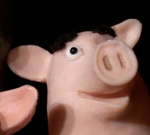
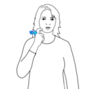
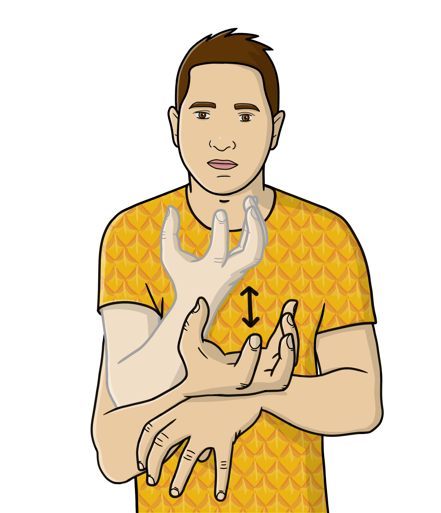
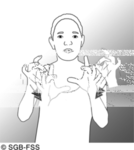

# SignPuddle

The [Swiss-French SignPuddle](https://www.signbank.org/signpuddle2.0/index.php?ui=1&sgn=49) includes around 5000 entries in SignWriting with an illustration.

## Data

We collected the data using `collect_data.py`.

### Issues

Since this data is unstructured, we assume all `png` files are illustrations, and all `jpg` files are pictographs.

This means that we have multiple types of data:

| Type                    | Example                                |
|-------------------------|----------------------------------------|
| Noise                   |           |
| No-person Illustration  |   |
| Blurry Illustration     |   |
| HD Illustration         |   |
| HD Colored Illustration |  |
| Corrupted               |   |
| Blurry Image + Arrows   |   |
| HD Image                |  |

Ideally, we should be able to classify these images, and apply some "tag" in their prompt.
We should not train on corrupted or noise images.

